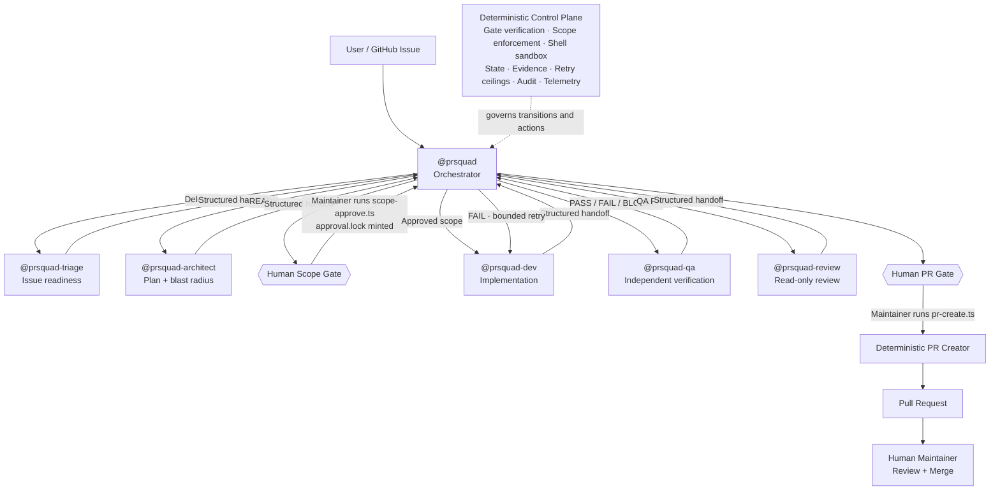
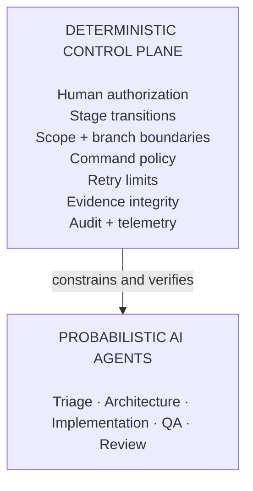

<p align="center">
  <strong>PRSquad</strong><br/>
  <em>Supervised Agentic Workflow for GitHub Copilot</em>
</p>

# PR Squad: Supervised Agentic Workflow

**Probabilistic agents - Deterministic control Plane - Human-in-the-loop control.**

PR Squad is a GitHub Copilot App/VS Code plugin that takes a GitHub issue through planning, implementation, independent QA, code review, and pull-request creation using specialized AI agents.

The agents remain probabilistic and isolated: they reason, plan, write code, validate behavior, and review changes. PR Squad adds a **deterministic control plane** around that reasoning to enforce critical workflow boundaries such as human approvals, scope containment, branch isolation, command restrictions, stage ordering, bounded retries, evidence integrity, and PR eligibility.

> **PR Squad does not make LLM reasoning deterministic. It makes the critical boundaries around agent autonomy deterministic.**

---

## ⚡ Quick Setup

> **Current build note:** PR Squad's hook runtime currently uses repository-relative paths. Validate installation in the target repository before treating the current build as fully portable across arbitrary repositories.

### GitHub Copilot App

1. Open the GitHub Copilot App and select **Customize → Plugins**.
2. In the **Plugins** view, click the icon next to the marketplace dropdown and add this repository as a custom marketplace:
   ```text
   https://github.com/vamsicherukuri/PRsquad
   ```
3. Find **`prsquad`** in the marketplace and click **Install**.
4. Open the repository and GitHub issue you want PR Squad to work on.

---

## 🚀 Run Your First Workflow

Open a repository with a GitHub issue and invoke:

```text
@prsquad resolve issue #22
```

PRSquad coordinates the workflow from the issue to a reviewable pull request:

```text
Issue → Triage → Plan → Human Scope Approval → Implementation → QA → Review → Human PR Approval → Pull Request
```

The specialists do **not** directly delegate work to one another. Every specialist returns a structured handoff to `@prsquad`, which validates the result and determines the next allowed action.

---

## Why PR Squad (Goverened Agentic workflow)?

PRSquad is a supervised agentic development workflow for GitHub Copilot that takes a GitHub issue through planning, implementation, independent QA, review, and pull-request creation using specialized AI agents.

### The Challenge

Agentic coding systems are powerful because LLMs can reason, plan, write code, use tools, and adapt to changing context. But that behavior is inherently probabilistic.

An agent can hallucinate, misinterpret intent, drift from the original objective, lose constraints across long-running workflows, act on stale or incorrect assumptions, or be influenced by untrusted data and prompt injection embedded in issues, source code, documentation, logs, or tool output.

There is also a fundamental difference between **what an agent believes is true and the actual state of the system**. A model may believe it is operating within the approved scope, on the correct branch, against validated code, or after a successful test run but its reasoning alone is not proof that those conditions are actually true.

As autonomy increases, critical development controls should not depend on the model remembering or correctly interpreting instructions.

> **Use AI for reasoning. Do not rely on AI to enforce the boundaries around its own autonomy.**

### The Solution

PRSquad separates **probabilistic reasoning from deterministic control**.

Specialized agents handle the work that benefits from AI reasoning triage, architecture, implementation, QA, and review while `@prsquad` orchestrates the workflow through structured stage handoffs.

An independent deterministic control plane verifies whether actions and transitions are permitted. It enforces approved scope, tool and branch boundaries, workflow ordering, bounded retries, evidence integrity, machine-state validation, and explicit human approval gates.

This allows agents to remain flexible in **how** they solve a problem without giving them unrestricted authority over **what** they may change, **when** they may proceed, or **whether** the workflow is allowed to advance.

PRSquad also makes agentic execution observable by tracking **AI credit consumption by agent and workflow stage**, providing visibility into the cost of planning, implementation, QA, review, and retry cycles.

> **Agents reason. The orchestrator coordinates. The control plane enforces. Humans approve. Execution remains observable.**

---

## Agentic Workflow. Deterministic Control Plane.

### Architecture

`@prsquad` is the supervisor and routing authority. It delegates each stage, receives the specialist's structured handoff, validates the result, and determines the next action. Specialists do not bypass the orchestrator to hand work directly to one another.



### The Two Layers



**Agents decide how to solve the problem. The control plane decides what they are allowed to do and when they are allowed to proceed.**

### What the Control Plane Enforces

| Control | What PRSquad does |
|---|---|
| **🔒 Human authorization** | Implementation cannot start without an active human-approved scope lock. Pull-request creation is also reserved for explicit human authorization. |
| **🛡 Scope & execution containment** | Agent writes are restricted to approved paths, protected branches are guarded, and shell commands are constrained by specialist role. |
| **🔁 Bounded autonomy** | Developer ↔ QA repair cycles have a fixed retry ceiling rather than allowing uncontrolled autonomous loops. |
| **✅ Independent verification** | QA is separate from the Developer and must verify the issue's acceptance criteria before review can proceed. |
| **🧬 Evidence integrity** | Approved plans, implementation references, QA evidence, review evidence, and current Git HEAD are checked so stale or unverified work cannot silently advance. |
| **⚡ Context & cost observability** | PRSquad uses deterministic precomputation, role-scoped context, repository-aware skills, workflow state, audit records, and Copilot AIU/token telemetry to reduce redundant work and expose resource consumption. |

Core governance guarantees are also represented as machine-readable security invariants and exercised by the repository's CI gate.

---

## Boundaries

- **LLM reasoning remains probabilistic.** Determinism applies to governance and execution boundaries, not to generated plans, code, QA reasoning, or review judgment.
- **Human authority is preserved.** Autonomous agents cannot mint their own scope approval or invoke PR creation on their own.
- **PRSquad stops at pull-request creation.** Final review and merge remain human-maintainer responsibilities.
- **Telemetry depends on runtime availability.** AIU/token reporting uses Copilot session telemetry when that data is available.
- **External-repository portability is still being validated.** The current hook configuration invokes bundled runtime scripts through repository-relative paths.

---

## Reference

<details>
<summary><strong>Agents and responsibilities</strong></summary>

| Agent | Responsibility | Key boundary |
|---|---|---|
| `@prsquad` | Orchestration, validation, routing, human-gate coordination | Does not inspect or modify product code |
| `@prsquad-triage` | Definition-of-Ready evaluation | No repository source access |
| `@prsquad-architect` | Technical plan, scope, blast-radius analysis | Read/search only |
| `@prsquad-dev` | Approved implementation + regression tests | Writes only inside approved scope |
| `@prsquad-qa` | Independent acceptance-criteria and regression validation | No source-code writes |
| `@prsquad-review` | Read-only final risk/security/code review | No fixes, no test execution |

Every specialist returns its result to `@prsquad`; specialists do not directly delegate to each other.

</details>

<details>
<summary><strong>Deterministic hooks</strong></summary>

PRSquad registers deterministic `preToolUse` / `postToolUse` hooks around critical actions:

| Hook | Purpose |
|---|---|
| `hook-intake-ingest` | Fetches and verifies issue context before Triage |
| `hook-verify-gate` | Validates stage ordering, approval locks, handoffs, retry budgets, evidence, and specialist delegation |
| `hook-enforce-scope` | Blocks file writes outside the approved scope |
| `hook-sandbox-bash` | Restricts terminal commands according to agent role |

Policy denials are treated as deliberate control-plane decisions, not transient agent errors.

</details>

<details>
<summary><strong>Security and governance invariants</strong></summary>

The repository defines machine-readable governance contracts covering areas such as:

- fail-closed specialist handoffs,
- strict QA PASS semantics,
- canonical plan-approval hashing,
- foreign-repository and cross-worktree write prevention,
- shell mutation and command-chaining prevention,
- stage-evidence monotonicity,
- non-destructive branch lifecycle,
- current-HEAD verification binding,
- human-only scope and PR authorization,
- hook runtime/timeout integrity,
- cumulative-diff review coverage.

These contracts are exercised by the repository's security-invariant and adversarial test suites.

</details>

<details>
<summary><strong>State, audit, and approval artifacts</strong></summary>

Runtime governance state is persisted under `.gated-change/`, including artifacts such as:

```text
.gated-change/
├── state.json
├── approval.lock
├── audit.jsonl
└── dashboard.json
```

The scope approval lock binds human authorization to the approved workflow state instead of allowing approval to exist only as conversational text.

</details>

<details>
<summary><strong>Repository-aware context and tooling</strong></summary>

PRSquad can detect or configure repository tooling for common ecosystems including:

- npm / Node.js
- Maven
- Gradle
- Pytest
- Cargo
- Go
- .NET

Repository instructions and skills are selected by specialist role and approved scope so agents receive relevant context without loading the full repository guidance into every stage.

</details>

<details>
<summary><strong>Human gates</strong></summary>

### Scope Gate

Implementation cannot begin until the maintainer explicitly authorizes the proposed plan by executing:

```text
npx -y tsx scripts/guardrails/scope-approve.ts
```

This creates `.gated-change/approval.lock`, which the control plane verifies before Developer delegation is allowed.

### PR Gate

After QA and Review complete, the maintainer explicitly authorizes pull-request creation by executing:

```text
npx -y tsx scripts/guardrails/pr-create.ts
```

PRSquad opens the pull request but never performs the final merge.

</details>

### Official plugin documentation

- [GitHub Copilot plugins](https://docs.github.com/en/copilot/concepts/agents/about-plugins)
- [Customizing the GitHub Copilot app](https://docs.github.com/en/enterprise-cloud@latest/copilot/how-tos/github-copilot-app/customize-github-copilot-app)
- [Agent plugins in VS Code](https://code.visualstudio.com/docs/agent-customization/agent-plugins)

---

## License

See [LICENSE](LICENSE).
