# PRsquad · Supervised Agentic Workflow for GitHub Copilot

> **"Supervised multi-agent autonomy with deterministic policy enforcement and cryptographically verified human approval gates."**

[](https://vamsicherukuri.github.io/gated-fix-pipeline/)
[](scripts/check-plugin-consistency.ts)
[-brightgreen?style=for-the-badge)](scripts/test-guardrails.ts)
[](https://github.com/features/copilot)
[](#)

---

### 🎮 Experience the Live Interactive Visualizer
Explore the complete 7-stage workflow, step through real issue simulations, and test the physical security hooks in your browser:
👉 **[Launch the Interactive PRsquad Simulator](https://vamsicherukuri.github.io/gated-fix-pipeline/)** *(or run locally via `npx tsx scripts/guardrails/visualizer-server.ts`)*

---

## What is PRsquad?

**PRsquad** is an enterprise-ready **Supervised Agentic Workflow** built natively for the **GitHub Copilot App**. 

Traditional autonomous AI coding agents suffer from runaway token burn, unconstrained file mutations, hallucinated package updates, and accidental base-branch pushes (`git push origin main`). PRsquad solves this by pairing a **Supervisor Orchestrator (`@prsquad`)** with **five specialized subagents** operating under **mechanical PreToolUse hooks**, **cryptographic human approval locks (`approval.lock`)**, and **hard-bounded repair loops**.

### Why "Supervised Agentic Workflow"?
Unlike unconstrained multi-agent frameworks, PRsquad enforces physical separation between **investigation**, **planning**, **human authorization**, **containment implementation**, **isolated verification**, and **review**.

```mermaid
flowchart TD
    subgraph Supervisor["🎮 Pipeline Supervisor Layer (@prsquad)"]
        Orch["@prsquad (Conductor)<br/>• Dynamic specialist routing • Bounded retry ceilings (max 3)<br/>• Halts at Scope Gate • 0 code tools"]
    end

    subgraph Phase1["🔍 Phase 1: Ingestion & Fast-Fail"]
        S0["Stage 0: Triage Specialist<br/>(@prsquad-triage)<br/>• Deterministic criteria extraction<br/>• Fast-fail in under 2s (0 LLM tokens)"]
    end

    subgraph Phase2["📐 Phase 2: Diagnostic Blast-Radius Planning"]
        S1["Stage 1: Architect Specialist<br/>(@prsquad-architect)<br/>• Read-only symbol jail<br/>• 1-hop caller/importer blast radius"]
    end

    subgraph Gate1["🔑 Phase 3: Cryptographic Scope Gate"]
        S2["Stage 2: Scope Approval Gate<br/>(Human Maintainer Review)<br/>• Cryptographic approval.lock on disk<br/>• Developer agent process physically blocked"]
    end

    subgraph Phase4["🔨 Phase 4: Contained Implementation"]
        S3["Stage 3: Developer Specialist<br/>(@prsquad-dev)<br/>• Isolated feature branch: fix/issue-N<br/>• Active write-barrier & smart nudges"]
    end

    subgraph Phase5["🧪 Phase 5: Independent Verification"]
        S4["Stage 4: QA Specialist<br/>(@prsquad-qa)<br/>• Isolated worktree test sandbox<br/>• 0 git mutation permissions"]
    end

    subgraph Phase6["🛡️ Phase 6: Contract & Security Sweep"]
        S5["Stage 5: Reviewer Specialist<br/>(@prsquad-review)<br/>• Read-only AST symbol contract sweep<br/>• OWASP & credential flaw check"]
    end

    subgraph Gate2["🚀 Phase 7: Governed Enterprise Delivery"]
        S6["Stage 6: PR Gate<br/>(Human Merge Gate)<br/>• Pull Request opened on GitHub<br/>• Auto-merge physically disabled"]
    end

    Orch --> S0
    S0 --> S1
    S1 --> S2
    S2 -->|"Maintainer /approve"| S3
    S3 --> S4
    S4 -->|"Tests Pass 100%"| S5
    S4 -.->|"Fail: Max 3 Rework Cycles"| S3
    S5 --> S6
```



---

## Architectural Comparison

| Dimension | Raw Autonomous Agents | PRsquad Supervised Workflow |
|---|---|---|
| **Execution Boundary** | Unconstrained file system & shell execution | **Physical PreToolUse Hooks** (`hook-enforce-scope`, `hook-sandbox-bash`) |
| **Human Oversight** | Prompt suggestions (easily bypassed by models) | **Cryptographic Barrier** (`approval.lock` physically halts developer spawn) |
| **Failure Recovery** | Open-ended loops ($\$\$$ runaway token burn) | **Hard Ceilings** (max 2 intake rounds, max 3 Dev/QA repair attempts) |
| **Context Hygiene** | Monolithic prompt dumps (high latency & cost) | **Semantic Slicing & Proximity Skills** (60–80% prompt token reduction) |
| **Branch Safety** | Directly mutates working tree / base branch | **Isolated Feature Branches** (`fix/issue-N`) with base branch push locks |
| **Verification** | Self-grading ("I checked my own code") | **Independent QA Specialist** running in an isolated worktree sandbox |

---

## Core Capabilities & Features

### 1. Zero-Token Deterministic Fast-Fail
* **Hook**: `hook-intake-ingest.mjs` (PreToolUse on `agent`, `task`)
* Intercepts issue intake in `<2000ms`. 
* Validates issue state directly against the GitHub API. If an issue is already closed or duplicate, the workflow terminates deterministically without burning a single LLM token.

### 2. Cryptographic Scope Gate (`approval.lock`)
* **Hook**: `hook-verify-gate.mjs` (PreToolUse & PostToolUse on `agent`, `task`)
* Prevents the `@prsquad-dev` agent process from spawning until the human maintainer explicitly types `/approve` in chat.
* Stores a machine-readable lock file (`approval.lock`) with approved file paths, max attempts, and maintainer signature.
* Detects and purges stale lock files across different issue sessions to prevent unauthorized cross-issue write leakage.

### 3. Surgical Write-Barrier & Smart Nudges
* **Hook**: `hook-enforce-scope.mjs` (PreToolUse on `edit`, `edit_file`, `write_to_file`, `create_file`)
* Enforces strict path-prefix boundaries declared in the approved plan.
* Edits outside approved scope (e.g. `package.json`, `.github/workflows/`) are blocked.
* Injects a structured `SCOPE_AMENDMENT_REQUIRED` smart nudge into the model's context, guiding the agent back into approved boundaries without crashing.

### 4. Shell Command Sandboxing & Base-Branch Lockdown
* **Hook**: `hook-sandbox-bash.mjs` (PreToolUse on `bash`, `powershell`, `execute`, `terminal`)
* Strictly forbids destructive commands (`git push origin main`, direct checkouts of `main`/`master`, branch deletions).
* Enforces role-based command restrictions: QA can only execute test runners (`npm test`, `pytest`, `mvn test`, `go test`); Reviewer is limited to non-mutating inspections (`git diff`, `git status`).

### 5. Semantic Instruction Slicing & Dynamic Tooling
* Slices monolithic repository instructions (`.github/copilot-instructions.md`) based on specialist role.
* Automatically detects repository build tooling from manifests (`package.json`, `pom.xml`, `pyproject.toml`, `go.mod`).
* Injects directory-proximity skills (`.prsquad/skills/`) only when relevant files are targeted, cutting token overhead by **60% to 80%**.

### 6. Lean V2 Canvas Webview (0% CPU Idle)
* Native GitHub Copilot App extension canvas (`canvas.html`).
* Implements dirty-state hashing to eliminate DOM reflows when telemetry hasn't changed.
* Real-time separation of Orchestrator burn vs Specialist execution burn.
* Clean command rendering (stripping shell wrapper boilerplate) and single-table checkpoint accordions.

---

## Verified Real-World Telemetry (Issue #22 Baseline)

The following metrics represent actual production execution from resolving Issue #22 (PR #24):

```text
⚡ Total Verified Telemetry:   93.66 AIU (47 turns, 246s)
🎮 Orchestrator Overhead:      38.33 AIU (9 turns, 40.9% supervision cost)
🛠️ Specialists Execution:      55.33 AIU (38 turns)
   ├── @prsquad-triage:         1.33 AIU (1 turn, fast-pass criteria extraction)
   ├── @prsquad-architect:      9.85 AIU (6 turns, blast-radius diagnosis)
   ├── @prsquad-dev:           25.28 AIU (16 turns, surgical implementation)
   ├── @prsquad-qa:            13.60 AIU (13 turns, 55/55 tests passed)
   └── @prsquad-review:         5.27 AIU (2 turns, AST sweep & OWASP audit)
📈 Prompt Cache Hit Rate:      82.5%
🔄 Bounded Repair Loops:       0/3 used (1st-pass green)
```

---

## 3-Minute Quickstart

### 1. Local Verification Suite
Clone the repository and run the comprehensive verification suite:

```bash
# 1. Clone repository
git clone https://github.com/vamsicherukuri/gated-fix-pipeline.git
cd gated-fix-pipeline && npm install

# 2. Run the 78-point Copilot App plugin consistency check
npm run check:plugin

# 3. Verify all 55 mechanical guardrail and security policies
npm run test:guardrails

# 4. Verify semantic instruction slicing and dynamic tooling detection
npm run test:skills

# 5. Run complete 7-stage end-to-end workflow simulation (100% pass)
npm run test:e2e
```

### 2. Installing in GitHub Copilot App
1. In the GitHub Copilot App, add this repository as a custom plugin marketplace (`.github/plugin/marketplace.json`).
2. Install **`prsquad`**.
3. Open any GitHub issue or task in the App and start a **Plan** session.
4. In chat, invoke `@prsquad`:
   ```text
   @prsquad resolve issue #22 using the supervised pipeline
   ```
5. Review the plan produced by `@prsquad-architect`.
6. Type `/approve` in chat to cryptographically sign `approval.lock`.
7. Watch `@prsquad-dev`, `@prsquad-qa`, and `@prsquad-review` execute under active hook containment, delivering a verified Pull Request stopping at the human Merge Gate.

---

## Repository Structure

```text
.github/
  plugin/marketplace.json      # Plugin marketplace manifest (prsquad v0.1.49)
  copilot-instructions.md      # Monolithic instructions (sliced dynamically)
plugins/gated-change/
  plugin.json                  # PRsquad plugin configuration
  com.github.copilot/
    agents/                    # 6 agent contracts (prsquad, triage, architect, dev, qa, review)
    hooks/hooks.json           # PreToolUse / PostToolUse hook registrations
  dist/                        # Bundled standalone ESM hooks (verify-gate, enforce-scope, sandbox-bash)
  extensions/                  # Native Canvas webview extension (canvas.html)
docs/
  index.html                   # Interactive Simulator & Visualizer for GitHub Pages
scripts/
  check-plugin-consistency.ts  # 78 static contract & routing invariant checks
  test-guardrails.ts           # 55 automated guardrail policy tests
  test-repo-skills.ts          # 39 tooling & semantic slicing tests
  test-e2e-simulation.ts       # 22-step autonomous end-to-end simulation
  test-edge-cases.ts           # 40 edge-case & adversarial failure tests
  test-layer-b.ts              # 25 runtime fault-injection & worktree tests
```

---

## License & Challenge Submission
Built for the **GitHub Copilot App Enterprise Challenge**. 
Licensed under the [MIT License](LICENSE).
