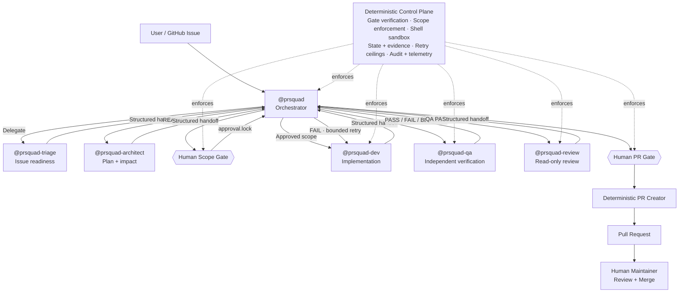
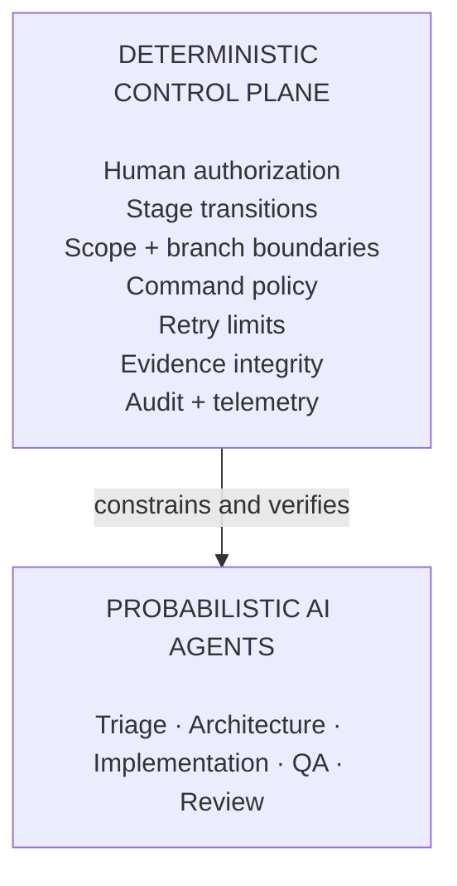

<p align="center">
  
</p>

# PRSquad: Supervised Agentic Workflow

**Probabilistic agents. Deterministic controls. Human authority.**

PRSquad is a GitHub Copilot plugin that takes a GitHub issue through planning, implementation, independent QA, code review, and pull-request creation using specialized AI agents.

The agents remain probabilistic: they reason, plan, write code, validate behavior, and review changes. PRSquad adds a **deterministic control plane** around that reasoning to enforce critical workflow boundaries such as human approvals, scope containment, branch isolation, command restrictions, stage ordering, bounded retries, evidence integrity, and PR eligibility.

> PRSquad does not make LLM reasoning deterministic. It makes the critical boundaries around agent autonomy deterministic.

---

## ⚡ 30-Second Setup

### GitHub Copilot App

1. Open **Customize → Plugins**.
2. Add this repository as a custom marketplace:
   ```text
   https://github.com/vamsicherukuri/PRsquad
   ```
3. Install **`prsquad`** from the marketplace.
4. Open the repository and GitHub issue you want PRSquad to work on.

### Visual Studio Code

1. Make sure GitHub Copilot Chat is available and Agent Plugins are enabled:
   ```json
   "chat.plugins.enabled": true
   ```
2. Open **Chat: Open Customizations → Plugins** or the Agent Plugins view in Extensions.
3. Add the PRSquad marketplace from:
   ```text
   https://github.com/vamsicherukuri/PRsquad
   ```
4. Install **`prsquad`** and open the target repository.

> VS Code also supports installing Agent Plugins from a Git repository or managing marketplaces with `/plugin` commands.

---

## 🚀 Run Your First Workflow

Open a repository with a GitHub issue and invoke:

```text
@prsquad resolve issue #22
```

PRSquad coordinates the workflow from the issue to a reviewable pull request:

```text
Issue → Triage → Plan → Human Scope Approval → Implementation → QA → Review → Human PR Approval → Pull Request
```

The specialists do **not** directly delegate work to one another. Every specialist returns a structured handoff to `@prsquad`, which validates the result and determines the next allowed action.

---

## Why PRSquad?

### The Challenge

Agentic coding workflows are good at reasoning and execution, but prompts alone cannot guarantee that an agent will stay inside an approved scope, respect branch boundaries, wait for human authorization, preserve stage ordering, stop after bounded retries, or prove that the code being submitted is the same code that was tested and reviewed.

As autonomy increases, these controls should not depend only on the model remembering instructions.

### The Solution

PRSquad separates **reasoning from control**.

Specialized agents perform the work that benefits from AI reasoning, while deterministic hooks and policy code independently control what actions are permitted and when the workflow may advance.

This creates a supervised workflow where the model can remain flexible without being the final authority over its own permissions.

---

# Agentic Workflow. Deterministic Control Plane.

## Architecture

`@prsquad` is the supervisor and routing authority. It delegates each stage, receives the specialist's structured handoff, validates the result, and decides what happens next. Agents do not bypass the orchestrator to hand work directly to another specialist.



### The Two Layers



**Agents decide how to solve the problem. The control plane decides what they are allowed to do and when they are allowed to proceed.**

---

## What the Control Plane Enforces

| Control | What PRSquad does |
|---|---|
| **🔒 Human authorization** | Implementation cannot start without an active human-approved scope lock. PR creation is also reserved for explicit human authorization. |
| **🛡 Scope & execution containment** | Agent writes are restricted to approved paths, protected branches are guarded, and shell commands are constrained by specialist role. |
| **🔁 Bounded autonomy** | Developer ↔ QA repair cycles have a fixed retry ceiling rather than allowing uncontrolled autonomous loops. |
| **✅ Independent verification** | QA is separate from the Developer and must verify the issue's acceptance criteria before review can proceed. |
| **🧬 Evidence integrity** | Approved plans, implementation references, QA evidence, review evidence, and current Git HEAD are checked so stale or unverified work cannot silently advance. |
| **⚡ Context & cost observability** | PRSquad uses deterministic precomputation, role-scoped context, repository-aware skills, workflow state, audit records, and Copilot AIU/token telemetry to reduce redundant work and expose resource consumption. |

Core governance guarantees are also represented as machine-readable security invariants and exercised by the repository's CI gate.

---

## How Supervision Works

The orchestrator is the single coordination point:

```text
                         ┌───────────────┐
                         │   @prsquad    │
                         │ Orchestrator  │
                         └───────┬───────┘
                                 │
          ┌──────────────┬───────┼───────┬──────────────┐
          │              │       │       │              │
          ▼              ▼       ▼       ▼              ▼
       Triage        Architect   Dev      QA          Reviewer
          │              │       │       │              │
          └──────────────┴───────┴───────┴──────────────┘
                                 │
                   Structured handoffs return
                     to the orchestrator
```

The orchestrator does not inspect or implement product code itself. Its job is to coordinate specialist execution, validate handoff contracts, route outcomes, respect human gates, and stop or escalate when deterministic policy denies progression.

---

## Boundaries

- **LLM reasoning is probabilistic.** Determinism applies to governance and execution boundaries, not to generated plans, code, QA reasoning, or review judgment.
- **Human authority is preserved.** Agents cannot mint their own scope approval or autonomously open/merge a pull request.
- **PRSquad stops at pull-request creation.** Final review and merge remain human-maintainer responsibilities.
- **Telemetry depends on runtime availability.** AIU/token reporting uses Copilot session telemetry when that data is available.
- **Plugin portability should be validated for your environment.** The current hook configuration invokes bundled runtime scripts through repository-relative paths, so external-repository installation should be verified before treating the current build as fully portable.

---

## Reference

<details>
<summary><strong>Agents and responsibilities</strong></summary>

| Agent | Responsibility | Key boundary |
|---|---|---|
| `@prsquad` | Orchestration, validation, routing, human-gate coordination | Does not inspect or modify product code |
| `@prsquad-triage` | Definition-of-Ready evaluation | No repository source access |
| `@prsquad-architect` | Technical plan, scope, blast-radius analysis | Read/search only |
| `@prsquad-dev` | Approved implementation + regression tests | Writes only inside approved scope |
| `@prsquad-qa` | Independent acceptance-criteria and regression validation | No source-code writes |
| `@prsquad-review` | Read-only final risk/security/code review | No fixes, no test execution |

Every specialist returns its result to `@prsquad`; specialists do not directly delegate to each other.

</details>

<details>
<summary><strong>Deterministic hooks</strong></summary>

PRSquad currently registers deterministic `preToolUse` / `postToolUse` hooks around critical actions:

| Hook | Purpose |
|---|---|
| `hook-intake-ingest` | Fetches and verifies issue context before Triage |
| `hook-verify-gate` | Validates stage ordering, approval locks, handoffs, retry budgets, evidence, and specialist delegation |
| `hook-enforce-scope` | Blocks file writes outside the approved scope |
| `hook-sandbox-bash` | Restricts terminal commands according to agent role |

Policy failures are designed to stop progression rather than be treated as ordinary transient agent errors.

</details>

<details>
<summary><strong>Security and governance invariants</strong></summary>

The repository defines machine-readable governance contracts covering areas such as:

- fail-closed specialist handoffs,
- strict QA PASS semantics,
- canonical plan-approval hashing,
- foreign-repository and cross-worktree write prevention,
- shell mutation and command-chaining prevention,
- stage-evidence monotonicity,
- non-destructive branch lifecycle,
- current-HEAD verification binding,
- human-only scope and PR authorization,
- hook runtime/timeout integrity,
- cumulative-diff review coverage.

These contracts are exercised by the repository's security-invariant and adversarial test suites.

</details>

<details>
<summary><strong>State, audit, and approval artifacts</strong></summary>

Runtime governance state is persisted under `.gated-change/`, including artifacts such as:

```text
.gated-change/
├── state.json
├── approval.lock
├── audit.jsonl
└── dashboard.json
```

The scope approval lock binds human authorization to the approved workflow state instead of allowing approval to exist only as conversational text.

</details>

<details>
<summary><strong>Repository-aware context and tooling</strong></summary>

PRSquad can detect or configure repository tooling for common ecosystems including npm, Maven, Gradle, Pytest, Cargo, Go, and .NET.

Repository instructions and skills are selected by specialist role and approved scope so agents receive relevant context without loading the full repository guidance into every stage.

</details>

<details>
<summary><strong>Human gates</strong></summary>

### Scope Gate

The current implementation requires the maintainer to explicitly authorize implementation before Developer execution can begin. The resulting `.gated-change/approval.lock` is then mechanically verified by the control plane.

### PR Gate

PR creation requires verified QA/review evidence and explicit human authorization. PRSquad never performs the final merge.

</details>

### Official plugin documentation

- [GitHub Copilot plugins](https://docs.github.com/en/copilot/concepts/agents/about-plugins)
- [Customizing the GitHub Copilot app](https://docs.github.com/en/enterprise-cloud@latest/copilot/how-tos/github-copilot-app/customize-github-copilot-app)
- [Agent plugins in VS Code](https://code.visualstudio.com/docs/agent-customization/agent-plugins)

---

## License

See [LICENSE](LICENSE).
