# PRsquad · Supervised Agentic Workflow for GitHub Copilot

> **"Supervised multi-agent autonomy with deterministic policy enforcement and cryptographically verified human approval gates."**

<p align="center">
  <a href="https://vamsicherukuri.github.io/gated-fix-pipeline/"><b>🎮 Live Interactive Simulator</b></a> ·
  <a href="#-quickstart-choose-your-path"><b>⚡ 30-Sec Quickstart</b></a> ·
  <a href="#-supervised-agentic-workflow-architecture"><b>📐 Architecture</b></a> ·
  <a href="#-token-accounting-by-stage"><b>📊 Token Accounting</b></a> ·
  <a href="#-specialist-agent-contracts"><b>🤖 Specialist Contracts</b></a> ·
  <a href="#-deterministic-decision-playbook"><b>🚦 Decision Playbook</b></a> ·
  <a href="#-enterprise-governance--efficiency-mechanisms"><b>🛡️ Governance</b></a>
</p>

<p align="center">
  <a href="https://vamsicherukuri.github.io/gated-fix-pipeline/"></a>
  <a href="scripts/check-plugin-consistency.ts"></a>
  <a href="scripts/test-guardrails.ts"></a>
  <a href="https://github.com/features/copilot"></a>
  <a href="#"></a>
  <a href="LICENSE"></a>
</p>

---

## What is PRsquad?

**PRsquad** is an enterprise-ready **Supervised Agentic Workflow** built natively for the **GitHub Copilot App**. 

Traditional autonomous AI coding agents suffer from runaway token burn, unconstrained file mutations, hallucinated package updates, and accidental base-branch pushes (`git push origin main`). PRsquad solves this by pairing a **Supervisor Orchestrator (`@prsquad`)** with **five specialized subagents** operating under **mechanical PreToolUse hooks**, **cryptographic human approval locks (`approval.lock`)**, and **hard-bounded repair loops**.

**Four deterministic mechanisms carry the governance and efficiency story:**
1. **Intake Triage** intercepts issues in `<2s` and validates acceptance criteria before any planning begins (0 LLM tokens).
2. **The Scope Gate** physically blocks the Developer agent process at the OS level until a human maintainer signs `approval.lock` in chat.
3. **The Write-Scope Barrier** rejects unauthorized file mutations and injects smart nudges, keeping agents inside their declared blast radius.
4. **The Bounded Repair Loop** hard-caps Developer ↔ QA rework cycles at 3 attempts before escalating to the maintainer, eliminating token bleed.

Cross-package impact is caught by a **zero-token TypeScript AST sweep**, not an expensive dedicated LLM agent.

---

## ⚡ Quickstart: Choose Your Path

### Path A: Instant Browser Simulator (0 Setup, 1-Click)
Step through all 7 stages, inspect real issue simulations, and trigger mechanical security hooks in your browser:
👉 **[Launch the Interactive PRsquad Simulator](https://vamsicherukuri.github.io/gated-fix-pipeline/)** *(or run locally via `npx tsx scripts/guardrails/visualizer-server.ts`)*

### Path B: Install in GitHub Copilot App
1. In the GitHub Copilot App, add this repository as a custom plugin marketplace (`.github/plugin/marketplace.json`).
2. Install **`prsquad`** (`v0.1.49`).
3. Open any GitHub issue or task in the App and start a **Plan** session.
4. In chat, invoke `@prsquad`:
   ```text
   @prsquad resolve issue #22 using the supervised pipeline
   ```
5. Review the plan produced by `@prsquad-architect`.
6. Type `/approve` in chat to cryptographically sign `approval.lock`.
7. Watch `@prsquad-dev`, `@prsquad-qa`, and `@prsquad-review` execute under active hook containment, delivering a verified Pull Request stopping at the human Merge Gate.

### Path C: Run Local Verification Suite
```bash
# 1. Clone repository
git clone https://github.com/vamsicherukuri/gated-fix-pipeline.git
cd gated-fix-pipeline && npm install

# 2. Run the 78-point Copilot App plugin consistency check
npm run check:plugin

# 3. Verify all 55 mechanical guardrail and security policies
npm run test:guardrails

# 4. Verify semantic instruction slicing and dynamic tooling detection
npm run test:skills

# 5. Run complete 7-stage end-to-end workflow simulation (100% pass)
npm run test:e2e
```

---

## 📐 Supervised Agentic Workflow Architecture

Unlike unconstrained multi-agent frameworks, PRsquad enforces physical separation between **investigation**, **planning**, **human authorization**, **containment implementation**, **isolated verification**, and **review**.

```mermaid
flowchart TD
    subgraph Supervisor["🎮 Pipeline Supervisor Layer (@prsquad)"]
        Orch["@prsquad (Conductor)<br/>• Dynamic specialist routing • Bounded retry ceilings (max 3)<br/>• Halts at Scope Gate • 0 code tools"]
    end

    subgraph Phase1["🔍 Phase 1: Ingestion & Fast-Fail"]
        S0["Stage 0: Triage Specialist<br/>(@prsquad-triage)<br/>• Deterministic criteria extraction<br/>• Fast-fail in under 2s (0 LLM tokens)"]
    end

    subgraph Phase2["📐 Phase 2: Diagnostic Blast-Radius Planning"]
        S1["Stage 1: Architect Specialist<br/>(@prsquad-architect)<br/>• Read-only symbol jail<br/>• 1-hop caller/importer blast radius"]
    end

    subgraph Gate1["🔑 Phase 3: Cryptographic Scope Gate"]
        S2["Stage 2: Scope Approval Gate<br/>(Human Maintainer Review)<br/>• Cryptographic approval.lock on disk<br/>• Developer agent process physically blocked"]
    end

    subgraph Phase4["🔨 Phase 4: Contained Implementation"]
        S3["Stage 3: Developer Specialist<br/>(@prsquad-dev)<br/>• Isolated feature branch: fix/issue-N<br/>• Active write-barrier & smart nudges"]
    end

    subgraph Phase5["🧪 Phase 5: Independent Verification"]
        S4["Stage 4: QA Specialist<br/>(@prsquad-qa)<br/>• Isolated worktree test sandbox<br/>• 0 git mutation permissions"]
    end

    subgraph Phase6["🛡️ Phase 6: Contract & Security Sweep"]
        S5["Stage 5: Reviewer Specialist<br/>(@prsquad-review)<br/>• Read-only AST symbol contract sweep<br/>• OWASP & credential flaw check"]
    end

    subgraph Gate2["🚀 Phase 7: Governed Enterprise Delivery"]
        S6["Stage 6: PR Gate<br/>(Human Merge Gate)<br/>• Pull Request opened on GitHub<br/>• Auto-merge physically disabled"]
    end

    Orch --> S0
    S0 --> S1
    S1 --> S2
    S2 -->|"Maintainer /approve"| S3
    S3 --> S4
    S4 -->|"Tests Pass 100%"| S5
    S4 -.->|"Fail: Max 3 Rework Cycles"| S3
    S5 --> S6
```



---

## 📊 Token Accounting by Stage

The following figures represent **measured production telemetry** from resolving Issue #22 (PR #24 baseline). Both human approval gates cost zero LLM tokens, and the only stage with rework risk is bounded by a hard ceiling of 3 attempts:

| Stage | Specialist / Actor | Primary Driver & Tools | Measured AIU | What Bounds It |
|---|---|---|---|---|
| **00 · Intake Triage** | `@prsquad-triage` | GitHub issue validation, acceptance criteria check | **1.33 AIU** *(0 if cached)* | **Fast-fails in <2s**; capped at 2 clarification rounds |
| **01 · Blast-Radius Plan** | `@prsquad-architect` | Read-only AST search, caller/importer graph | **9.85 AIU** *(6 turns)* | Read-only jail; single pass without self-loops; feeds Scope Gate |
| **02 · Scope Gate** | **Human Maintainer** | Plain-language plan review; issues `/approve` | **0.00 AIU** *(zero tokens)* | **Cryptographic lock** (`approval.lock`); blocks Dev process |
| **03 · Contained Fix** | `@prsquad-dev` | Code generation & tests on `fix/issue-N` | **25.28 AIU** *(16 turns)* | **Write barrier** (`hook-enforce-scope.mjs`); branch push locks |
| **04 · Verification** | `@prsquad-qa` | Test runner execution (`npm test`, 55/55 passed) | **13.60 AIU** *(13 turns)* | Isolated worktree; **0 git mutations**; capped at 3 retries |
| **05 · Contract Sweep** | `@prsquad-review` | AST symbol contract sweep, OWASP audit | **5.27 AIU** *(2 turns)* | **0-token TS Compiler AST engine**; flags only |
| **06 · PR Gate & Merge** | **Human Maintainer** | Dual-review of PR diff, verification logs & notes | **0.00 AIU** *(zero tokens)* | Auto-merge physically disabled; human clicks merge |
| **Pipeline Conductor** | `@prsquad` | Dynamic routing, state store, loop enforcement | **38.33 AIU** *(9 turns)* | Supervision cost: 40.9% of budget; **0 code tools** |

---

## 🤖 Specialist Agent Contracts

Each stage's input is the prior specialist's structured JSON envelope, never the raw chat transcript re-read from scratch. Physical PreToolUse hooks enforce tool permissions at the operating system level:

### `@prsquad-triage` · Triage Specialist
* **Mandate**: Validates issue completeness and reproducibility before spending expensive LLM planning tokens.
* **Reads**: Issue title and body only (via GitHub API).
* **Writes**: Structured triage envelope (`READY`, `NOT_READY`, `EMPTY`, `FETCH_FAILED`).
* **Escalates**: Maintainer after 2 clarification rounds.

### `@prsquad-architect` · Architect Specialist
* **Mandate**: Maps 1-hop caller/importer blast radius and drafts surgical fix plan — zero code edits.
* **Reads**: Repository code bounded to declared scope + 1-hop caller/importer graph.
* **Writes**: Technical plan JSON (`PLAN_READY`, `BLOCKED`) — **0 code edits, read-only symbol jail**.
* **Escalates**: Feeds Stage 2 Scope Gate for human maintainer approval.

### `@prsquad-dev` · Developer Specialist
* **Mandate**: Implements contained code fix strictly on isolated feature branch `fix/issue-N`.
* **Reads**: Approved plan, isolated feature branch files.
* **Writes**: Source code inside approved scope only — **contained by `hook-enforce-scope.mjs`**.
* **Escalates**: Maintainer after 3 failed repair cycles, or requests Scope Amendment for out-of-scope files.

### `@prsquad-qa` · QA Specialist
* **Mandate**: Validates fix correctness in an isolated worktree test sandbox with zero git mutations.
* **Reads**: Feature branch diff, test suites.
* **Writes**: Test execution artifacts and logs only — **0 git push/commit permissions (`hook-sandbox-bash.mjs`)**.
* **Escalates**: Feeds the bounded retry loop back to `@prsquad-dev` on failure (max 3 cycles).

### `@prsquad-review` · Reviewer Specialist
* **Mandate**: Performs read-only AST symbol contract sweep and security review — flags only.
* **Reads**: Feature branch diff, AST symbol references across repository.
* **Writes**: Review report (`CLEAR`, `CONCERNS`) — **flags only, 0 code edits**.
* **Escalates**: Stage 6 PR Gate (human maintainers decide whether to merge).

### `@prsquad` · Supervisor Conductor
* **Mandate**: Orchestrates specialist lifecycle, maintains state, and enforces retry ceilings.
* **Reads**: Chat instructions, specialist return envelopes.
* **Writes**: Specialist delegations — **0 code edit / search tools**.
* **Escalates**: Human maintainer at Scope Gate and on retry exhaustion.

---

## 🚦 Deterministic Decision Playbook

What actually happens when a stage doesn't go cleanly:

| Operational Event | Condition / Trigger | Pipeline Action | Retry / Token Cost |
|---|---|---|---|
| **Intake Triage** | Issue has clear criteria & scope | Proceeds to Architect planning | 0 retries consumed |
| **Intake Triage** | Issue is vague / missing criteria | Emits targeted clarification prompt (max 2 rounds) | Consumes 1 clarification round |
| **Intake Triage** | Closed / duplicate issue | Deterministic fast-fail in `<2s` | **0 LLM tokens spent** |
| **Scope Gate** | Maintainer types `/approve` | Auto-signs `approval.lock`; unblocks Developer process | Zero retry cost; human gate |
| **Scope Gate** | Maintainer requests revision | Architect re-plans with updated boundaries (1 pass) | Consumes 1 revision round |
| **Scope Gate** | Maintainer types `/reject` | Revokes lock; workflow terminates cleanly | Zero retry cost; clean halt |
| **Write Barrier** | Mutation within approved scope | PreToolUse permits file edit | Normal execution |
| **Write Barrier** | Mutation outside approved scope | PreToolUse denies edit; injects `SCOPE_AMENDMENT_REQUIRED` nudge | Agent self-corrects; 0 drift |
| **Write Barrier** | Edit to `.github/` or `.gated-change/` | PreToolUse strictly blocks protected paths | Hard block |
| **QA Verification** | All tests pass (55/55) | Proceeds to Reviewer specialist | 0 retries consumed |
| **QA Verification** | Scoped test regression detected | Packages failure logs back to Developer for repair | Consumes 1 retry (max 3) |
| **QA Verification** | 4th consecutive failure | Pipeline pauses; alerts maintainer with audit logs | Ceiling hit; no runaway burn |
| **AST Sweep** | Exported symbol broken across repo | Surfaces caller drift to Developer within repair budget | Fixed in-flight |
| **PR Gate** | Maintainer reviews & merges PR | Human clicks merge on GitHub; branch pruned | Zero LLM tokens |

---

## ⚖️ Architectural Comparison

| Dimension | Raw Autonomous Agents | PRsquad Supervised Workflow |
|---|---|---|
| **Execution Boundary** | Unconstrained file system & shell execution | **Physical PreToolUse Hooks** (`hook-enforce-scope`, `hook-sandbox-bash`) |
| **Human Oversight** | Prompt suggestions (easily bypassed by models) | **Cryptographic Barrier** (`approval.lock` physically halts developer spawn) |
| **Failure Recovery** | Open-ended loops ($\$\$$ runaway token burn) | **Hard Ceilings** (max 2 intake rounds, max 3 Dev/QA repair attempts) |
| **Context Hygiene** | Monolithic prompt dumps (high latency & cost) | **Semantic Slicing & Proximity Skills** (60–80% prompt token reduction) |
| **Branch Safety** | Directly mutates working tree / base branch | **Isolated Feature Branches** (`fix/issue-N`) with base branch push locks |
| **Verification** | Self-grading ("I checked my own code") | **Independent QA Specialist** running in an isolated worktree sandbox |

---

## 🛡️ Enterprise Governance & Efficiency Mechanisms

### 1. Bounded Retry Ceilings (No Runaway Loops)
The Developer ↔ QA repair loop can hand back at most `3` times. A 4th failure does not spend a 4th round of tokens — it escalates to the maintainer and the pipeline pauses. This is the single biggest lever on runaway cost, since unbounded fix↔test loops are where multi-agent workflows bleed tokens.

### 2. Cryptographic Scope Lock (`approval.lock`)
Unlike prompt-based suggestions that models routinely ignore, the Scope Gate is enforced by a physical PreToolUse hook (`hook-verify-gate.mjs`). The Developer agent process is physically aborted at the operating system level unless a verified `approval.lock` signed by a human maintainer exists on disk.

### 3. Surgical Write-Barrier & Smart Nudges
The `hook-enforce-scope.mjs` hook intercepts all file-writing tools (`edit`, `edit_file`, `write_to_file`, `create_file`). Edits outside approved scope (e.g. `package.json`, `.github/workflows/`) are blocked. Instead of failing the entire agent session, the hook injects a structured `SCOPE_AMENDMENT_REQUIRED` smart nudge into the model's context, guiding it back into approved boundaries.

### 4. Shell Command Sandboxing & Base-Branch Lockdown
The `hook-sandbox-bash.mjs` hook strictly forbids destructive commands (`git push origin main`, direct checkouts of `main`/`master`, branch deletions). It enforces role-based command restrictions: QA can only execute test runners (`npm test`, `pytest`, `go test`); Reviewer is limited to non-mutating inspections (`git diff`, `git status`).

### 5. Zero-Token Deterministic AST Sweep
Cross-package caller impact is verified using the TypeScript compiler API (`ast-symbol-sweep.ts`), not an expensive dedicated LLM agent. The sweep analyzes exported symbols and caller references in milliseconds with **0 LLM tokens**, surfacing warnings directly to the Reviewer.

### 6. Semantic Instruction Slicing & Proximity Skills
Instead of dumping monolithic instructions into every prompt, PRsquad dynamically extracts only the sections relevant to the active specialist's role. Combined with directory-proximity skills (`.prsquad/skills/`), this cuts token overhead by **60% to 80%**.

### 7. Lean V2 Canvas Webview (0% CPU Idle)
Native GitHub Copilot App extension canvas (`canvas.html`) with dirty-state hashing to eliminate DOM reflows when telemetry hasn't changed. Features real-time separation of Orchestrator burn vs Specialist execution burn.

---

## 📁 Repository Structure

```text
.github/
  plugin/marketplace.json      # Plugin marketplace manifest (prsquad v0.1.49)
  copilot-instructions.md      # Monolithic instructions (sliced dynamically)
plugins/gated-change/
  plugin.json                  # PRsquad plugin configuration
  com.github.copilot/
    agents/                    # 6 agent contracts (prsquad, triage, architect, dev, qa, review)
    hooks/hooks.json           # PreToolUse / PostToolUse hook registrations
  dist/                        # Bundled standalone ESM hooks (verify-gate, enforce-scope, sandbox-bash)
  extensions/                  # Native Canvas webview extension (canvas.html)
docs/
  index.html                   # Interactive Simulator & Visualizer for GitHub Pages
  architecture.html            # Complete Enterprise Architecture Specification
scripts/
  check-plugin-consistency.ts  # 78 static contract & routing invariant checks
  test-guardrails.ts           # 55 automated guardrail policy tests
  test-repo-skills.ts          # 39 tooling & semantic slicing tests
  test-e2e-simulation.ts       # 22-step autonomous end-to-end simulation
  test-edge-cases.ts           # 40 edge-case & adversarial failure tests
  test-layer-b.ts              # 25 runtime fault-injection & worktree tests
```

---

## ⭐ Star History & Community

If you find PRsquad useful for supervised agentic workflows and deterministic policy enforcement, please star this repository!

<a href="https://star-history.com/#vamsicherukuri/gated-fix-pipeline&Date">
 <picture>
   <source media="(prefers-color-scheme: dark)" srcset="https://api.star-history.com/svg?repos=vamsicherukuri/gated-fix-pipeline&type=Date&theme=dark" />
   <source media="(prefers-color-scheme: light)" srcset="https://api.star-history.com/svg?repos=vamsicherukuri/gated-fix-pipeline&type=Date" />
   
 </picture>
</a>

### Community & Feedback
* **Issues**: Report reproducible bugs or request enhancements via [GitHub Issues](https://github.com/vamsicherukuri/gated-fix-pipeline/issues).
* **Discussions**: Discuss workflow patterns and governance hooks on [GitHub Discussions](https://github.com/vamsicherukuri/gated-fix-pipeline/discussions).

---

## 🔒 Security Disclosure
Security vulnerabilities should be reported privately via [GitHub Security Advisories](https://github.com/vamsicherukuri/gated-fix-pipeline/security/advisories) rather than public issues.

---

## 📜 License & Challenge Submission
Built for the **GitHub Copilot App Enterprise Challenge**.  
Licensed under the [MIT License](LICENSE).
