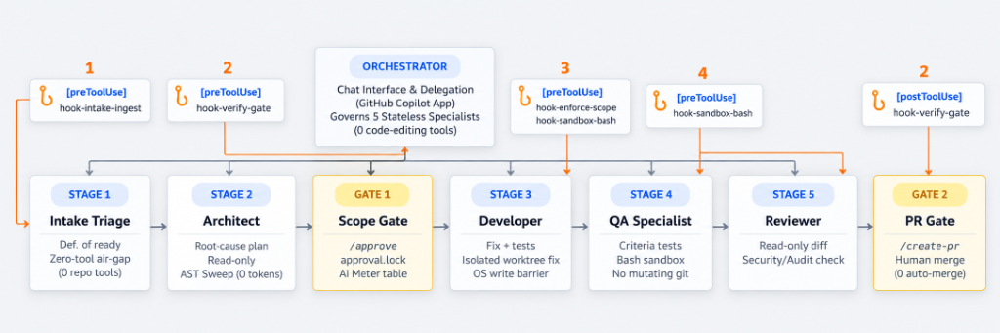
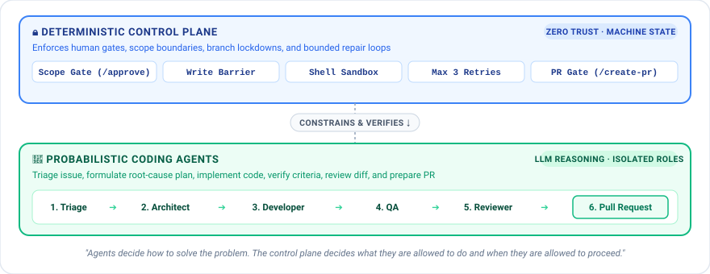
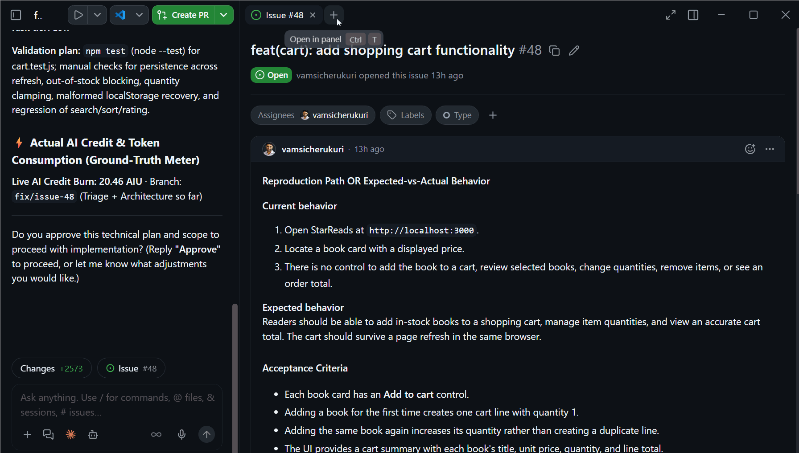

# PR Squad: Supervised Agentic Workflow

[](https://github.com/vamsicherukuri/PRsquad)
[](https://github.com/vamsicherukuri/PRsquad/releases)
[](https://vamsicherukuri.github.io/PRsquad/)
[-3fb950?style=flat-square&logo=githubactions&logoColor=white)](https://vamsicherukuri.github.io/PRsquad/)


### The Challenge: Coding Agent Autonomy

Agentic coding systems are powerful because LLMs can reason, plan, write code, use tools, and adapt to changing context. But that behavior is inherently probabilistic.

An agent can hallucinate, misinterpret intent, drift from the original objective, lose constraints during long running workflows, act on stale assumptions, or be influenced by untrusted data and prompt injection embedded in issues, source code, documentation, logs, or tool output.

There is also a fundamental difference between what an agent believes is true and the actual state of the system. A model may believe it is operating within the approved scope, on the correct branch, against validated code, or after a successful test run but reasoning alone does not prove those conditions are true.

As agent autonomy increases, critical development controls should not depend on the model remembering or correctly interpreting instructions.


> **Use AI for reasoning. Do not rely on AI to enforce the boundaries around its own autonomy.**

### The Solution: Probabilistic Agents, Deterministic Control

PR Squad separates AI reasoning from deterministic workflow control.

Specialized agents perform role specific work within defined scopes, while the `@prsquad` orchestrator coordinates execution through structured stage handoffs.

An independent deterministic control plane mechanically enforces approved write scopes, role-based command restrictions, protected branch rules, stage ordering, bounded repair loops, evidence integrity, and non-bypassable human approval gates.

This preserves flexibility in how agents solve a problem without giving them authority to bypass the policies governing what they may change and when the workflow may advance.

PR Squad also provides stage level observability by tracking AI credit and token consumption across specialist agents and rework cycles.

> **Agents reason. The orchestrator coordinates. The control plane enforces. Humans approve. Execution remains observable.**


## ⚡ Quick Setup

1. Open the **GitHub Copilot Desktop App** and click **Customize** in the left sidebar.
2. In the Marketplaces section, add this repository if not already listed:

   ```text
   https://github.com/vamsicherukuri/PRsquad
   ```
3. Click **+ Add** in the top-right corner and select **Install plugin...**.
4. In the dialog, enter the marketplace plugin spec:
   ```text
   prsquad@prsquad-marketplace
   ```
5. Click **Install**.
6. **Restart the GitHub Copilot App** so its backend daemon loads the newly installed agent catalog into memory.


## 🚀 Run Your First Workflow

1. Open your target repository in the **GitHub Copilot Desktop App**.
2. Add a new project or open an existing one, select the GitHub issue you want to work on, and click **New Session**.
3. In the chat prompt bar, open the **Agent Picker** dropdown (the `Default agent` selector next to the model picker) and choose **`prsquad`**.
4. Prompt PR Squad to start on your issue:

```text
Resolve issue
```

PR Squad orchestrates the workflow from a GitHub issue to a review-ready Pull Request, while deterministic hooks enforce governance within each agent's defined scope and permissions:

```text
Issue → Triage → Plan → Human Scope Gate → Implementation → QA → Review → Human PR Gate → Pull Request
```

Specialist agents do **not** directly delegate work to one another. Every specialist returns a structured handoff to orchestrator, which validates the result and determines the next allowed action under deterministic policy enforcement.

## Architecture at a Glance



## The Execution & Control Planes




### ⚡ Hook Interception Matrix

4 Deterministic Hook Engines enforcing 6 Specialized Guardrails across the lifecycle.

| # | Hook Interception | Deployed At Which Agent? | Trigger Event |
|:---:|---|---|---|
| 1 | **Deterministic Ingest Hook** | Orchestrator → Intake Agent | `preToolUse` on `agent` (quarantines issue before Intake starts). |
| 2 | **Mechanical Scope Gate Hook** | Orchestrator → Developer Agent | `preToolUse` on `agent` (blocks Developer dispatch if `.approval.lock` is missing). |
| 3 | **Write-Scope Barrier Hook** | Developer Agent | `preToolUse` on `edit_file`, `write_to_file`, `create_file` (blocks out-of-scope edits). |
| 4 | **QA Bash Sandbox Hook** | QA Specialist Agent | `preToolUse` on `bash` / `powershell` (permits test runners, but blocks `git push` & `commits`). |
| 5 | **Reviewer Read-Only Sandbox** | Reviewer Agent | `preToolUse` on `bash` / `powershell` (strictly allowlists `git diff`, blocks `>` redirects). |
| 6 | **State & AI-Credit Telemetry Hook** | Orchestrator Level | `postToolUse` on `agent` (executes whenever *any* specialist finishes and returns). |

Only a human can authorize the implementation plan at the **Scope Gate** before code can be written, and approve opening the pull request at the **PR Gate** once independent verification is complete. Final code review and merging always remain with humans.


### 🛡️ What the Control Plane Enforces


| Control | What PRSquad does |
|---|---|
| **🔒 Human authorization** | Implementation cannot start without an active human-approved scope lock. Pull-request creation is also reserved for explicit human authorization. |
| **🛡 Scope & execution containment** | Agent writes are restricted to approved paths, protected branches are guarded, and shell commands are constrained by specialist role. |
| **🔁 Bounded autonomy** | Developer ↔ QA repair cycles have a fixed retry ceiling rather than allowing uncontrolled autonomous loops. |
| **✅ Independent verification** | QA is separate from the Developer and must verify the issue's acceptance criteria before review can proceed. |
| **🧬 Evidence integrity** | Approved plans, implementation references, QA evidence, review evidence, and current Git HEAD are checked so stale or unverified work cannot silently advance. |
| **⚡ Context & cost observability** | PRSquad uses deterministic precomputation, role-scoped context, repository-aware skills, workflow state, audit records, and Copilot AIU/token telemetry to reduce redundant work and expose resource consumption. |


## Coding Agent Observability & Live Canvas

[](https://vamsicherukuri.github.io/PRsquad/)



PR Squad makes multi-agent execution observable by tracking workflow state, resource usage, retries, and deterministic policy decisions throughout the workflow.

### ⚡ AI Credit & Token Telemetry

At each specialist handoff, `postToolUse` hooks capture Copilot session telemetry and workflow state.

- **Per-Stage Cost Breakdown**: Tracks AI credit consumption (AIUs), prompt tokens, completion tokens, and cache usage across Triage, Architecture, Implementation, QA, and Review.
- **In-Chat AI Credit Meter**: Surfaces accumulated resource usage and workflow retry status directly in the Copilot chat.
- **Rework Cost Tracking**: Accounts for additional AI usage across Developer ↔ QA repair cycles and bounded retries.

### 🎨 PR Squad Live Visual Canvas

The **[PR Squad Live Visual Canvas](https://vamsicherukuri.github.io/PRsquad/)** provides a visual view of workflow progress, agent activity, and deterministic control plane decisions:

- **7-Stage Workflow View**: Shows the pipeline from Issue Intake through Pull Request creation, including active, completed, blocked, and human-gated stages.
- **Stage Details**: Inspect the active agent, role-specific context, repository skills, instructions, and token usage for each stage.
- **Deterministic Checkpoints**: Shows Allow (✓) and Block (⛔) decisions produced by the four hook engines: `hook-intake-ingest`, `hook-verify-gate`, `hook-enforce-scope`, and `hook-sandbox-bash`.
- **Interactive Policy Sandbox**: Simulate and inspect scope enforcement, command restrictions, approval locks, and stale-evidence protections.


---

## License

See [LICENSE](LICENSE).
