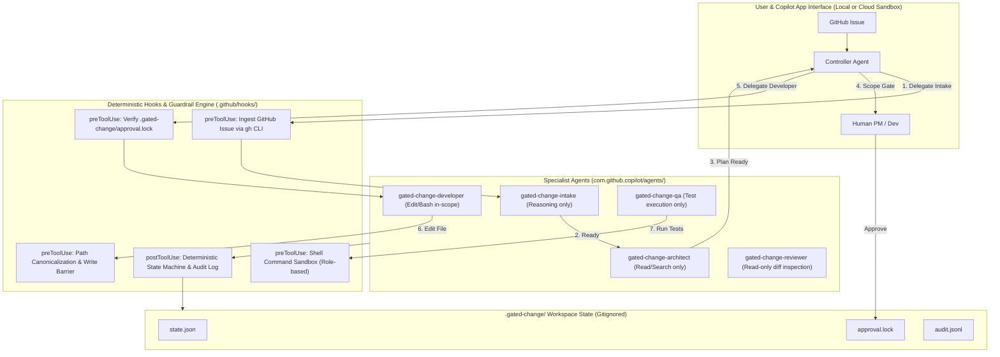

# Gated Change — Enterprise Guardrails & Architecture Design Plan

This document establishes the authoritative technical design for implementing **deterministic hooks, state machines, and governance guardrails** in the Gated Change workflow for the GitHub Copilot App Enterprise Challenge.

---

## 1. Core Architecture & Philosophy

The objective is to transform the workflow from **prompt-guided intent** into **machine-enforced governance**.



---

## 2. Deterministic State Machine Engine (`state.json`)

### Why Hooks Run the State Machine
Instead of relying on the LLM to remember attempt counts, round limits, and approval flags in chat memory, **the hooks execute deterministic TypeScript state transitions**.

* **The Store:** `.gated-change/state.json` (auto-created on session start, gitignored).
* **The Transition Rules:**
  - `intakeRound`: Initial check is `0`. Incremented on each human clarification up to max `2`. At `3`, hook denies further intake and forces escalation.
  - `phase`: Strictly follows `INTAKE -> ARCHITECTING -> AWAITING_SCOPE_APPROVAL -> DEVELOPING -> QA_VALIDATING -> REVIEWING -> PR_READY`.
  - `implementationAttempt`: Starts at `1`. Incremented when QA returns a `FAIL` verdict. If attempt reaches `3` and fails, hook freezes execution and escalates.
  - `humanApproval`: Boolean locked by the physical presence of `.gated-change/approval.lock`.

### `state.json` Schema
```json
{
  "version": "1.0",
  "sessionId": "gcc-vamsicherukuri-gated-fix-pipeline-42-1727390000",
  "issue": {
    "owner": "vamsicherukuri",
    "repo": "gated-fix-pipeline",
    "number": 42
  },
  "phase": "AWAITING_SCOPE_APPROVAL",
  "intakeRound": 0,
  "maxIntakeRounds": 2,
  "scopeRevisionCount": 0,
  "maxScopeRevisions": 2,
  "implementationAttempt": 1,
  "maxImplementationAttempts": 3,
  "approvedScope": "src/services/auth/",
  "humanApproval": false,
  "baseRef": "a8f3b21c4e...",
  "updatedAt": "2026-09-26T23:50:00Z"
}
```

---

## 3. The 4 Deterministic Guardrails

### Guardrail 1: The Mechanical Scope Gate (Hard Approval Lock)

#### Problem
In conversation, an LLM might mistake polite acknowledgment (e.g. *"looks ok"*) or an injected prompt in an issue for human approval, delegating to Developer prematurely.

#### Solution
1. **The Physical Lock:** The Controller cannot invoke `gated-change-developer` unless `.gated-change/approval.lock` exists with a matching hash.
2. **Acceptable Human Response:**
   - The user must switch from **Plan mode** to **Agent mode** in the Copilot App.
   - The user responds with explicit confirmation: `APPROVE SCOPE: <path>` or runs the local task:
     ```bash
     npm run gate:approve -- --scope src/services/auth/
     ```
3. **Multi-Attempt Token Lifecycle:**
   - **Retries (Tests Fail within Scope):** The lock stores `maxAttempts: 3` and `currentAttempt: 1`. When QA fails a test, `currentAttempt` increments. **The human is NOT prompted again** as long as work stays within the approved scope.
   - **Scope Expansion:** If Developer touches an unapproved file, the lock is paused until the human explicitly re-approves the expanded scope.
   - **Exhaustion:** If attempt 3 fails, the lock file is renamed to `approval.lock.exhausted`, completely halting automated coding.

---

### Guardrail 2: Dynamic Scope Expansion & Developer Nudge Protocol

#### Problem
Architect predicts `src/auth/service.ts`, but Developer discovers that `src/common/errors.ts` also needs changes. If the hook blindly blocks writes, how does Developer finish without crashing or looping?

#### Solution
1. **Scope Defined by Directory Prefix:**
   - Human approval is granted for a path prefix (e.g., `src/auth/`).
   - If Developer creates `src/auth/types.ts` within the prefix, the hook **allows** it.
2. **The "Smart Nudge" Denial Protocol:**
   - When Developer calls `edit` on `src/common/errors.ts`, the hook returns:
     ```json
     {
       "decision": "deny",
       "reason": "POLICY_DENIAL: 'src/common/errors.ts' is outside approved scope 'src/auth/'. ACTION: Do NOT retry editing this file. Return a SCOPE_AMENDMENT_REQUIRED handoff with: 1) requestedPaths, 2) reason, 3) impactIfRejected."
     }
     ```
3. **Structured Scope Amendment Handoff:**
   - Developer emits:
     ```json
     {
       "status": "SCOPE_AMENDMENT_REQUIRED",
       "scopeAmendmentRequest": {
         "requestedPaths": ["src/common/errors.ts"],
         "reason": "Missing custom AuthExpiredError code in common error registry",
         "impactIfRejected": "Must throw generic 500 error instead of clean auth expiration"
       }
     }
     ```
   - Controller routes to Architect: *"Is this a genuine plan gap?"*
   - Architect confirms (`SCOPE_AMENDMENT_CONFIRMED`).
   - Human PM receives the amendment request with full justification. Upon approval, `.gated-change/approval.lock` is updated to include the new path.

---

### Guardrail 3: Shell Sandbox & Privilege Separation (QA & Reviewer)

#### Reviewer Safeguards (`gated-change-reviewer.agent.md`)
* **Mandate:** Read-only inspection of diffs. Never writes code, never runs tests.
* **Hook Rule:** Strict **Allowlist** on `bash`:
  ```regex
  ^git\s+(diff|status|show|log|ls-files)(\s+.*)?$
  ```
  Any command containing write redirects (`>`, `>>`), file modifications, `npm test`, or `git push` is blocked instantly.

#### QA Safeguards (`gated-change-qa.agent.md`)
* **Mandate:** Executes tests against original acceptance criteria. Never edits source code.
* **Hook Rule:** Targeted **Blacklist** on `bash`:
  - **Permitted:** Arbitrary test runners (`npm test`, `npx vitest`, `pytest`, `cargo test`, `mvn test`).
  - **Forbidden:** Mutating git operations (`git commit`, `git push`, `git checkout main`, `git reset --hard`).
* **Artifact Exemption:** Build/test artifacts (`node_modules/.cache`, `coverage/`, `.pytest_cache/`, `test.db`) are excluded from write-scope blocking to avoid false permission errors during test runs.

---

### Guardrail 4: 3-Tier Semantic Engine (LSP Fallback & Latency Control)

#### Problem
Customer environments frequently lack installed or configured LSP server daemons (`typescript-language-server`, `pyright`), or experience latency/timeouts.

#### Solution: Progressive Enhancement Hierarchy
1. **Tier 1 (Default - Zero External Dependencies): AST & Regex Indexer**
   - Uses Node.js / embedded TypeScript compiler parser to extract exported symbols from changed files.
   - Searches repository boundaries for external imports in <150ms.
2. **Tier 2 (Repository Build CLI):**
   - Executes the repository's native typechecker (`npm run build` or `npx tsc --noEmit`). If external packages break, compiler errors are surfaced as zero-token blast-radius evidence.
3. **Tier 3 (LSP Server - Optional):**
   - Active only if `.github/lsp.json` is present.
4. **Latency & Transient Failure Handling:**
   - **Timeout:** Hard timeout of **3000ms** on any semantic query.
   - **Crash Recovery:** If an LSP daemon or compiler fails or times out, the hook falls back seamlessly to Tier 1 without stalling the workflow.

---

## 4. Deterministic Issue Ingestion Hook Recommendation

### The Recommendation: **Strongly Endorsed**
Instead of having `gated-change-intake` call GitHub API tools via LLM reasoning:
1. When Controller invokes `agent: "gated-change-intake"`, a `preToolUse` hook intercepts the call.
2. The hook deterministically executes:
   ```bash
   gh issue view <issue-number> --json number,title,body,comments,labels,author
   ```
3. The hook injects the validated issue JSON payload directly into the subagent prompt.
4. **Benefits:**
   - **Zero LLM Tool-Call Failures:** Eliminates parameter hallucination, rate limit retries, and API tool mismatches.
   - **Turn & Token Savings:** Eliminates the two-turn tool execution loop. Intake evaluates the payload immediately on Turn 1.
   - **Sanitized Boundary:** Intake receives data as pure input without needing ambient GitHub write/read credentials.

---

## 5. Agent Responsibilities & Zero-Overlap Matrix

| Agent | Target Spec | Allowed Tools | Read Source? | Write Code? | Run Tests? | Core Deliverable |
| :--- | :--- | :--- | :---: | :---: | :---: | :--- |
| **Controller** | `gated-change-controller` | `agent` only | ❌ | ❌ | ❌ | Workflow orchestration & state logging |
| **Intake** | `gated-change-intake` | None (Hook-fed) | ❌ | ❌ | ❌ | Definition of Ready verdict & declared scope |
| **Architect** | `gated-change-architect` | `read`, `search` | ✅ | ❌ | ❌ | Technical plan & 1-hop blast-radius analysis |
| **Developer** | `gated-change-developer` | `read`, `search`, `edit`, `bash` | ✅ | ✅ (In-Scope) | ✅ (Narrow) | Fix implementation & regression tests |
| **QA** | `gated-change-qa` | `read`, `search`, `bash` | ✅ | ❌ | ✅ (Full) | Acceptance criteria validation & test classification |
| **Reviewer** | `gated-change-reviewer` | `read`, `search`, `bash` (RO) | ✅ | ❌ | ❌ | Risk, security, & quality audit for Merge Gate |

---

## 6. Workspace Lifecycle & Ephemeral File Cleanup

1. **Ignored Runtime Directory:**
   `.gated-change/` is added to `.gitignore`. It exists only in the local workspace or cloud sandbox container.
2. **Pre-PR Sanitization:**
   Before handing off to Reviewer or creating a PR, a deterministic cleanup step executes:
   ```bash
   git clean -fd --exclude=.gated-change
   ```
   This purges transient test databases, coverage folders, and build dumps.
3. **Post-Merge Archive:**
   Once the Human Merge Gate approves, `.gated-change/audit.jsonl` is uploaded to CI workflow artifacts, and `.gated-change/` is cleanly removed.
